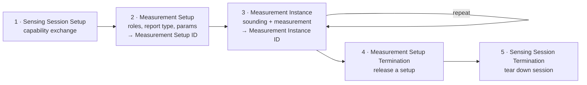

# 802.11bf: WLAN Sensing as a First-Class Standard

> **The forward-looking centerpiece of Latent Radios.** Every other entry in this
> catalog is about *repurposing* silicon the vendor never meant to be a sensor —
> patching closed firmware, scraping undocumented CSI registers, reverse-engineering
> a beamforming report struct. IEEE 802.11bf inverts that premise: it makes *sensing*
> a native, negotiated, spec-defined service of the Wi-Fi MAC/PHY. This page explains
> what the amendment actually is, how its measurement machinery works at both sub-7 GHz
> and 60 GHz, why it does **not** make [nexmon_csi](../projects/nexmon.md) or the rest of
> the [CSI toolchains](../projects/csi-toolchains.md) obsolete, and where standardized
> sensing sits on our [SDR ladder](./taxonomy.md).

**Status of this document:** the amendment itself is `verified` (P802.11bf completed
SA ballot and was approved for publication in 2025); forward-looking claims about
commercial chipset/OS exposure are flagged `reported`/`theoretical` inline.

---

## 1. What 802.11bf is

IEEE 802.11bf is an **amendment to the 802.11 standard** — "IEEE Std 802.11bf,
Amendment: Enhancements for Wireless Local Area Network (WLAN) Sensing" — produced by
**Task Group bf (TGbf)** of the IEEE 802.11 Working Group. Its stated Project
Authorization Request goal is to *"define modifications to … the WLAN … to provide
advanced sensing requirements while minimizing the effect on communications."* In
plain terms: turn the ambient RF that Wi-Fi radios already transmit into a first-class,
queryable measurement service, without breaking the data plane those radios exist for.

The amendment covers **two frequency regimes**:

- **Sub-7 GHz sensing** — the "conventional" case, built on the OFDM sounding
  machinery of 802.11n/ac/ax/be (HE and EHT PPDUs, NDP/NDPA, HT/VHT/HE/EHT-LTFs).
  The measurement product is **channel state information (CSI)** — the same physical
  quantity the rest of this catalog extracts by force.
- **60 GHz DMG/EDMG sensing** — directional multi-gigabit sensing on 802.11ad/ay
  hardware, built on **beamforming training (TRN) fields**. The measurement product is
  angular/range information from beam sweeps rather than per-subcarrier CSI.

### 1.1 Timeline and task group

TGbf ran a conventional IEEE letter/SA ballot cadence:

| Milestone | Date | Notes |
|---|---|---|
| Study Group / TGbf formed | 2020–2021 | Chartered under 802.11 WG |
| Draft **D0.1** | Apr 2022 | First numbered draft |
| Draft **D1.0** | Jan 2023 | First WG letter ballot draft |
| Draft **D2.0** | Jul 2023 | |
| Draft **D3.0** | Nov 2023 | |
| Draft **D4.0** → SA ballot | May 2024 | Initial SA ballot ~90% approval, ~207 comments |
| SA ballot recirculations | 2024 → Jan 2025 | Multiple recirculations; final recirc ~98% approval |
| WG / RevCom / SASB approval | 2025 | Approved for publication |

**Leadership (TGbf officers):**

- **Chair:** Tony Xiao Han (Huawei)
- **Vice-Chairs:** Sang Kim (LG Electronics), Assaf Kasher
- **Secretary:** Leif Wilhelmsson (Ericsson)
- **Technical Editor:** Claudio da Silva (Meta Platforms)

Authoritative running status lives on the TGbf update page:
<https://www.ieee802.org/11/Reports/tgbf_update.htm>.

### 1.2 Where it sits on the Latent Radios ladder

802.11bf is the first mainstream Wi-Fi feature that is **born at Tier 2 (CSI) or above,
by design, on the manufacturer's own signed firmware path** — no patch, no jailbreak,
no register scraping:

- **Sub-7 GHz → native Tier 2.** A compliant STA can *request* per-subcarrier CSI
  through a standardized measurement exchange and receive it in a defined report frame.
  This is exactly the quantity that costs a firmware patch on a
  [BCM43455c0](./walkthroughs/nexmon-csi-to-usable-csi.md) today.
- **60 GHz DMG → Tier 3-flavored.** Beam-swept TRN measurements expose spatial/range
  structure of the raw PHY that ordinary packet capture never sees — closer in spirit
  to our [spectral/raw-PHY tier](./verification-tier3-spectral.md), though it is
  angular rather than a spectrogram.

Crucially, 802.11bf does **not** climb to Tier 4/5 (arbitrary-waveform / raw-IQ TX /
open PHY). It standardizes *access to a measurement*, not *control of the waveform*.
You still cannot synthesize an arbitrary IQ stream through a compliant 802.11bf stack —
for that you remain in true-SDR or deep-firmware-patch territory
(see [true-SDR comparison](./true-sdr-comparison.md)).

---

## 2. Architecture: roles and entities

802.11bf separates **who orchestrates** the measurement from **who physically
transmits/receives** the sounding waveform. This decoupling is the conceptual core of
the amendment.

| Role | Definition |
|---|---|
| **Sensing initiator** | STA that initiates the sensing procedure (session setup, measurement setup). May be an AP or a non-AP STA. |
| **Sensing responder** | STA that participates in a procedure initiated by an initiator. AP or non-AP. |
| **Sensing transmitter** | STA that transmits the PPDU(s) used for sensing measurements. |
| **Sensing receiver** | STA that receives sensing PPDUs and performs the measurement (e.g., estimates CSI). |

The key subtlety, straight from the standard's framework: **"a sensing initiator can be
either a sensing transmitter or a sensing receiver, both, or neither."** The initiator
is a *controller* role; the transmit/receive roles are *physical* roles, and one device
can hold any combination. This is what lets a single AP orchestrate a many-STA
multistatic measurement it does not physically participate in.

### 2.1 Sensing by Proxy (SBP)

**Sensing by Proxy** lets a resource-constrained **non-AP STA (the SBP initiator)**
ask an **AP (the SBP responder)** to run a WLAN-sensing procedure *on its behalf*. The
AP performs the actual measurement exchange with other STAs and **reports the results
back** to the SBP initiator. This matters for phones/wearables that want sensing output
without paying the airtime and compute of orchestrating it — the AP, which already has
the channel picture, becomes a sensing service provider.

---

## 3. The sensing measurement procedure

The general WLAN-sensing procedure is a **five-phase lifecycle**. Different negotiated
attribute sets get a **Measurement Setup ID**; individual measurement rounds get a
**Measurement Instance ID**, so a session can carry several concurrent, differently
parameterized measurements.

1. **Sensing session setup** — the initiator establishes a session with responder(s)
   and they exchange **sensing capabilities** (which bands, roles, and report types each
   supports).
2. **Sensing measurement setup** — parties agree on operational attributes: STA roles,
   **measurement report type**, sounding parameters, timing. Each distinct attribute set
   is assigned a **Measurement Setup ID**.
3. **Sensing measurement instance** — the actual sounding-and-measurement exchange. Each
   round is a **Measurement Instance**. This is where NDPs are sounded and CSI (or TRN
   measurements) are produced.
4. **Sensing measurement (setup) termination** — a given measurement setup is torn down
   and its resources released, without necessarily ending the session.
5. **Sensing session termination** — STAs stop measuring and the session ends.

The **sensing measurement report** is the deliverable of phase 3: a defined frame (or
feedback) carrying the measurement result — CSI at sub-7 GHz, or beam/TRN-derived data
at 60 GHz — back to the requesting entity. Reporting can be **immediate** or **delayed**,
and can be made **threshold-based**: a STA reports a **CSI variation feedback value**
only when the change exceeds a negotiated threshold, saving airtime for
presence/motion-style applications that only care about *change*.

---

## 4. Sub-7 GHz sensing (CSI-based)

Sub-7 GHz sensing reuses the **null-data-packet (NDP) sounding** machinery that
802.11ac/ax already use for beamforming, but re-tasks it to produce a *sensing*
measurement rather than a steering matrix. Two families exist depending on who
initiates.

### 4.1 Trigger-Based (TB) sensing

Used when an **AP is the sensing initiator** and coordinates one or more non-AP STAs.
A TB sensing measurement instance is built from up to four phases (some optional):

| Phase | What happens |
|---|---|
| **Polling phase** | The AP polls candidate responder STAs to learn who is available to participate in this instance. |
| **NDPA sounding phase** | The initiator AP (as sensing transmitter) sends an **NDP Announcement (NDPA)** followed by an **NDP** to the STAs acting as sensing receivers, which estimate the downlink channel. |
| **TF sounding phase** | The AP sends a **Trigger Frame (TF)** requesting sensing-transmitter STAs to transmit uplink NDPs, so the AP (as sensing receiver) can measure the uplink channel. |
| **Reporting phase** | Measurement results are reported — immediate or delayed, full CSI or threshold-based variation. |

This structure lets one AP harvest both downlink (AP→STA) and uplink (STA→AP) channel
measurements across a fleet of stations inside a single trigger-coordinated exchange —
the natural substrate for whole-room multistatic sensing.

### 4.2 Non-Trigger-Based (non-TB) sensing

Used when a **non-AP STA is the initiator** and the **AP is the responder**. The
initiator sends a **Sensing NDPA** to the responder AP to configure the parameters for
the subsequent **I2R NDP** (initiator-to-responder) and **R2I NDP**
(responder-to-initiator), and the two exchange sounding packets bidirectionally without
a central trigger.

### 4.3 The measurement: CSI, quantized

At sub-7 GHz the sensing product is **CSI** — the complex channel gain per OFDM
subcarrier per antenna pair, exactly the matrix our
[Tier-2 verification page](./verification-tier2-csi.md) treats as the gold standard.
802.11bf standardizes how that CSI is fed back (report frame formats, quantization, and
optional compression), which is precisely the part that today is
vendor-specific-and-undocumented and drives the whole
[CSI toolchains](../projects/csi-toolchains.md) ecosystem. See
[techniques.md](./techniques.md) for what CSI physically is and how motion/breathing/
gesture pipelines consume it.

---

## 5. 60 GHz DMG sensing (beamforming-based)

At 60 GHz the channel is highly directional and the useful signal is **spatial** —
angle and range from narrow beams — rather than a few tens of OFDM subcarriers. So
802.11bf builds DMG/EDMG sensing on the **beamforming training (TRN) field** machinery
of 802.11ad/ay instead of on NDP/CSI.

- **TRN fields** are appended to **Beam Refinement Protocol (BRP)** frames. A TRN field
  is a series of **TRN subfields**; the antenna weight vector (**AWV**) can be changed
  per TRN subfield to **sweep through beams**, so the receiver measures the channel
  across a set of directions in one packet.
- For **multistatic** operation, extra **Sync fields** are inserted after the EDMG-STF
  so multiple distinct receivers can synchronize to the sounding transmission.

DMG sensing defines several **topologies**:

| Type | Geometry |
|---|---|
| **Monostatic** | One device both transmits and receives (radar-like). |
| **Bistatic** | Separate transmitter and receiver STAs. |
| **Multistatic** | One transmitter, multiple distinct receivers. |
| **Coordinated** variants | The above, orchestrated by a sensing initiator. |
| **Passive** | Sensing off already-present frames (beacons, sector sweeps) with no dedicated sounding. |

The monostatic 60 GHz mode is the closest the standard comes to a genuine **radar** —
it is the lineage behind Wi-Fi gesture/vital-sign demos on 802.11ad silicon (cf.
Google Soli's separate 60 GHz FMCW radar, which is *not* 802.11-based but occupies the
same band and application space).

---

## 6. Does 802.11bf obsolete nexmon_csi and the CSI toolchains? No.

This is the question the rest of this catalog forces, so answer it squarely.

**What 802.11bf changes:** it standardizes *access*. On compliant hardware, obtaining
CSI becomes a **negotiated, documented, signed-firmware operation** instead of a
firmware patch. In principle you will `ioctl`/netlink your way to CSI the way you query
link statistics today, with no [Nexmon](../projects/nexmon.md) patch, no
[PicoScenes](../projects/picoscenes.md)-style out-of-tree driver, no reverse-engineered
report struct.

**Why the existing toolchains stay essential — for years:**

1. **Installed base.** Every Wi-Fi device already in the world — every BCM43455 in a
   Raspberry Pi, every Intel AX200 laptop, every ESP32 — is *not* 802.11bf and never
   will be. The only way to get CSI from that fleet remains
   [nexmon_csi](./walkthroughs/nexmon-csi-to-usable-csi.md),
   [PicoScenes](../projects/picoscenes.md), the
   [Intel/Atheros CSI tools](../projects/csi-toolchains.md), and ESP-CSI.
2. **Standardization ≠ availability.** A published amendment does not put an exposed API
   on a shipping product. Vendors must implement it, expose it up the stack, and OSes
   must surface it — a multi-year gap. (`reported`/`theoretical` — see §7.)
3. **Access ≠ raw fidelity.** 802.11bf feeds back **quantized, possibly compressed** CSI
   through a *report* path chosen by the vendor. Research-grade pipelines that today rely
   on full-resolution, per-subcarrier complex CSI (and on injection/monitor control the
   standard does not grant) will still reach for the raw firmware path. Threshold-based
   reporting explicitly *discards* the fine detail some applications want.
4. **802.11bf gives you a measurement, not the radio.** It is a Tier-2/3 *access*
   standard. It grants no monitor mode, no injection, no arbitrary-waveform TX, no raw
   IQ. Everything above Tier 3 in this catalog — Tier-4 arbitrary-waveform work,
   [openwifi](../projects/openwifi.md)-style open PHY, true SDR — is untouched by it.

**The honest framing:** 802.11bf *legitimizes and democratizes* what this catalog does
by hand, and over time it will move the *easy* CSI use-cases (presence, motion, fall
detection) onto a supported path. It does not retire the reverse-engineering craft —
it defines a clean Tier-2 baseline that the RE work now sits *above*, reaching for the
fidelity and control the standard deliberately withholds.

---

## 7. Expected chipset and OS support

`reported` / `theoretical` — no compliance logo program had broadly shipped at the time
of writing; treat specific vendor claims as forward-looking.

- **Silicon.** The vendors that chaired/edited TGbf and shipped the underlying sounding
  hardware are the obvious first movers: **Qualcomm** (which has publicly demoed Wi-Fi
  sensing on its APs — see [qualcomm-atheros.md](../chips/qualcomm-atheros.md)),
  **Broadcom** ([broadcom-cypress.md](../chips/broadcom-cypress.md)), **MediaTek**
  Filogic ([mediatek-ralink.md](../chips/mediatek-ralink.md)), and **Intel**
  ([intel.md](../chips/intel.md)). All already ship the NDP/beamforming machinery
  802.11bf re-tasks, so support is a firmware/driver matter more than new silicon.
- **60 GHz.** DMG sensing rides on 802.11ad/ay parts; the installed 60 GHz base is small
  (Qualcomm/Facebook Terragraph, some docking/VR radios), so sub-7 GHz CSI-based sensing
  will dominate early deployments.
- **OS exposure.** The standard defines the *over-the-air* procedure, not a host API.
  Expect the measurement to surface first inside vendor SDKs and AP/mesh firmware
  (home-presence, fall-detection product features), and only later — if at all — as a
  general Linux `nl80211`/`cfg80211` capability. Until a kernel API lands, the practical
  Linux path to CSI remains the reverse-engineered stacks in
  [csi-toolchains.md](../projects/csi-toolchains.md).

---

## 8. Privacy and security

Standardizing sensing makes the privacy question sharper, not softer: a compliant AP can
*ask* your device to help measure the room, and the channel itself leaks who and what is
moving in it. 802.11bf's own security clause addresses two threat classes:

- **Sensing report overhearing** — a malicious party harvests the measurement *results*
  (the report frames). Mitigations: cryptographic encryption of reports and physical-layer
  security on the report path.
- **Sensing packet/signal overhearing** — an eavesdropper estimates the channel from the
  sounding *signals* themselves, sensing the environment without consent. Proposed
  countermeasures manipulate the transmitted sounding waveform — e.g., **protected LTF
  sequences** or a **masked TRN sequence** that imposes an artificial channel response,
  so that **only the legitimate sensing initiator can invert the mask** back to the true
  channel measurement. An unauthorized receiver sees a deliberately corrupted channel.

Broader, non-normative privacy concerns that this catalog should keep in view:

- **Passive DMG and CSI motion-sensing are inherently non-consensual to bystanders** —
  the person being sensed need not be associated with, or even aware of, the network.
- **Standardization lowers the attack floor.** The very win of 802.11bf — sensing without
  a firmware patch — also means a compromised or hostile AP can run high-quality
  room-occupancy inference with commodity, in-spec behavior. See
  [rf-safety-and-legal.md](./rf-safety-and-legal.md) for the regulatory/ethical framing
  this catalog applies to any sensing or TX activity.

---

## 9. Summary — where 802.11bf lands

| Dimension | 802.11bf |
|---|---|
| Nature | IEEE 802.11 **amendment** (TGbf), published 2025 |
| Bands | **Sub-7 GHz** (CSI/NDP) and **60 GHz** (DMG/TRN beamforming) |
| Measurement | CSI (sub-7 GHz); angular/range beam data (60 GHz) |
| Core roles | initiator / responder (control) × transmitter / receiver (physical); **SBP** proxy |
| Procedure | 5-phase: session setup → measurement setup → measurement instance → setup termination → session termination |
| Ladder tier | **Native Tier 2** (sub-7 GHz CSI); Tier-3-flavored (60 GHz raw-PHY angular) |
| Grants | standardized *access* to a measurement |
| Does **not** grant | monitor/injection control, raw IQ, arbitrary-waveform TX, open PHY (Tier 4/5) |
| Effect on this catalog | complements, does not replace, [nexmon](../projects/nexmon.md) / [CSI toolchains](../projects/csi-toolchains.md) |

**Bottom line:** 802.11bf turns "sensing" from a firmware-reverse-engineering stunt into
a negotiated Wi-Fi service — a clean, native Tier-2 baseline. The reverse-engineering
craft this catalog documents does not disappear; it moves *up the stack*, chasing the
raw fidelity and radio control the standard deliberately leaves on the table.

---

## References

1. R. Du, H. Xie, M. Hu, Narengerile, Y. Xin, S. McCann, M. Montemurro, T. X. Han, J. Xu,
   *"An Overview on IEEE 802.11bf: WLAN Sensing,"* arXiv:2207.04859 (2022) — the primary
   technical overview by TGbf participants. <https://arxiv.org/abs/2207.04859>
2. F. Restuccia, *"IEEE 802.11bf: Toward Ubiquitous Wi-Fi Sensing,"* arXiv:2103.14918
   (2021). <https://arxiv.org/abs/2103.14918>
3. IEEE 802.11 Task Group bf (TGbf) status/update page.
   <https://www.ieee802.org/11/Reports/tgbf_update.htm>
4. IEEE 802.11 Working Group project page. <https://www.ieee802.org/11/>
5. C. Chen et al., *"Wi-Fi Sensing Based on IEEE 802.11bf,"* IEEE Communications
   Magazine (2023) — surveys the amendment's sensing framework and use cases.
   <https://ieeexplore.ieee.org/document/10012421>

### Related pages in this catalog
- [techniques.md](./techniques.md) — what CSI is and how sensing pipelines consume it
- [csi-toolchains.md](../projects/csi-toolchains.md) — the RE tools 802.11bf complements
- [nexmon.md](../projects/nexmon.md) · [nexmon_csi walkthrough](./walkthroughs/nexmon-csi-to-usable-csi.md)
- [taxonomy.md](./taxonomy.md) — the SDR ladder this feature is placed on
- [verification-tier2-csi.md](./verification-tier2-csi.md) · [verification-tier3-spectral.md](./verification-tier3-spectral.md)
- [true-sdr-comparison.md](./true-sdr-comparison.md) · [rf-safety-and-legal.md](./rf-safety-and-legal.md)
