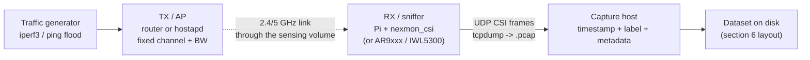
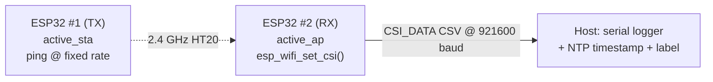

# Build a Reproducible Wi-Fi CSI Testbed

*A bench recipe for CSI experiments that someone else — or you, six months later — can actually repeat. The hardware layout, the environmental controls, the traffic generation, the logging, and above all the **metadata** that turns a pile of `.csv`/`.pcap` files into a reusable dataset.*

> **Honest tier framing.** Everything here is **Tier 2 (CSI)** on the [SDR ladder](../taxonomy.md): per-subcarrier complex channel estimates handed to you by closed silicon, not raw IQ. A testbed does not change the tier — it changes whether your *measurement* is trustworthy. The single biggest failure of published Wi-Fi-sensing work is not the model or the chip; it is that the capture conditions were never written down, so nobody (including the authors) can reproduce or fairly compare the numbers. This page is about fixing that.

**Related pages**
- [`../../projects/csi-toolchains.md`](../../projects/csi-toolchains.md) — the extraction tools (Nexmon CSI, Atheros CSI Tool, ESP32-CSI-Tool, PicoScenes, CSIKit) whose formats you will be logging.
- [`../../docs/methodology.md`](../../docs/methodology.md) — how *this catalog* records provenance and status; the discipline below is the same idea applied to your own captures.
- [`./nexmon-csi-to-usable-csi.md`](./nexmon-csi-to-usable-csi.md) — capturing + cleaning CSI on a Raspberry Pi (a concrete RX for the "AP + sniffer" layout).
- [`./esp32-csi-breathing-monitor.md`](./esp32-csi-breathing-monitor.md) — the ESP32-pair layout in miniature.
- [`../../projects/wifi-sensing-datasets.md`](../../projects/wifi-sensing-datasets.md) — public datasets; read their (often thin) documentation as cautionary examples.
- [`../honest-limitations-of-wifi-sensing.md`](../honest-limitations-of-wifi-sensing.md) — why domain shift makes uncontrolled captures nearly worthless across environments.

> **Scope & consent.** Sensing people through Wi-Fi has real privacy implications. Capture only in spaces you control, with informed consent from anyone in the room, and label subjects by pseudonymous id, never by name. See [`../rf-safety-and-legal.md`](../rf-safety-and-legal.md). The receive-only layouts here transmit nothing beyond ordinary Wi-Fi traffic you already generate; the ESP32 pair transmits ordinary 2.4 GHz Wi-Fi frames within normal power limits.

---

## 1. The core problem: CSI is only meaningful *relative to its conditions*

CSI is the channel response **H** — it encodes *everything* between the two antennas: geometry, multipath, the people and furniture in the room, the exact center frequency, the antenna orientation, and a stack of hardware impairments (CFO, SFO, STO, AGC gain steps, automatic phase offsets) that the firmware never tells you about. Two captures of "a person walking" taken in different rooms, on different channels, or even after nudging an antenna, are **different distributions**. A model trained on one routinely collapses on the other (see [`../honest-limitations-of-wifi-sensing.md`](../honest-limitations-of-wifi-sensing.md) and [`../ml-csi-sensing.md`](../ml-csi-sensing.md) on domain generalization).

The consequence for a testbed: **the recording is not the data — the recording *plus* the conditions is the data.** A reproducible testbed is one where the conditions are (a) held fixed on purpose and (b) written into the dataset so a reader can reconstruct or, at minimum, correctly *distrust* them.

---

## 2. Choose a layout

Two layouts cover almost everything. Pick one and freeze it for the whole study.

### Layout A — TX access point + RX sniffer (commodity NIC)

The classic research rig. A dedicated **transmitter** (a Wi-Fi AP, a second laptop in AP mode, or any router) beacons and answers pings; a **receiver** running a CSI-extraction firmware/driver logs `H` for every packet it demodulates. This is the layout for Intel 5300 (Linux 802.11n CSI Tool), Atheros ath9k (Atheros CSI Tool), and Broadcom (Nexmon CSI on a Raspberry Pi).



- **Pros:** real Wi-Fi bandwidths (up to 80 MHz on Nexmon), many subcarriers, mature parsers ([CSIKit](https://github.com/Gi-z/CSIKit), [PicoScenes](https://ps.zpj.io/)).
- **Cons:** kernel/firmware-version-locked; grouped/quantized CSI on the commodity NICs; you must pin the exact firmware (section 5).
- **Canonical RX:** a Raspberry Pi 3B+/4 with BCM43455c0 + nexmon_csi — cheap, documented, reproducible. See [`./nexmon-csi-to-usable-csi.md`](./nexmon-csi-to-usable-csi.md).

### Layout B — ESP32 pair (MCU, no firmware RE)

Two ESP32 boards: one runs `active_sta` and pings, the other runs `active_ap` and dumps CSI over UART. The only Tier-2 path with an **official vendor API** (`esp_wifi_set_csi`), so there is no patched-kernel fragility — the strongest choice for *reproducibility* even though it is 1×1 and HT20-only (≤64 subcarriers, 52 usable).



- **Pros:** ~\$5/board, fully standalone, deterministic packet rate, no kernel coupling, trivially portable; the packet cadence is set by *your* code, not a rate-adaptation black box.
- **Cons:** single antenna, 20 MHz only, 2.4 GHz only; Espressif's CSI ordering/L-LTF quirks vary by part and IDF version (pin the IDF tag — section 5).

> **Rule of thumb.** For a *teaching* or *reproducible-baseline* testbed, prefer **B** (nothing rots). For richer 5 GHz / MIMO / 80 MHz captures, use **A** and accept the version-pinning burden.

---

## 3. Fix the geometry — and write it down

The channel is a function of positions. If the positions are not fixed and recorded, the dataset is not reproducible. Concretely:

1. **Mount, don't hold.** Antennas on tripods or taped to walls at a measured height. A hand-held antenna adds an uncontrolled body reflector and drifts between takes.
2. **Measure the link.** TX–RX separation, antenna height above floor, and antenna **polarization/orientation** (vertical vs horizontal — it changes `H`). Record in centimeters.
3. **Mark subject positions on the floor.** Painter's tape crosses labelled `P1..Pn`, with a photographed floor plan. "Walking between P2 and P4" is reproducible; "walking around" is not.
4. **Draw a to-scale room sketch** with TX, RX, marked positions, and major reflectors (metal cabinets, windows). Save it *in the dataset* (`docs/room_layout.png`).
5. **Freeze the RF geometry per session.** Once you start recording, do not move an antenna. Moving one starts a **new session** with new geometry metadata.

```
   (top-down room sketch — store the real one as an image)
   +-------------------------------------------+
   |  window                                   |
   |                                           |
   |   [TX]                          [RX]      |   TX-RX = 300 cm
   |    |                             |        |   height = 100 cm
   |    |    P1     P2     P3     P4  |        |   both antennas vertical
   |    o----x------x------x------x---o        |
   |                                           |
   |                          [metal cabinet]  |
   +-------------------------------------------+
```

---

## 4. Control the environment

### 4.1 Empty-room baseline (always capture it first)

Before any subject enters, record **60+ seconds of the empty room** at each channel you will use. This baseline is the reference for static multipath and for detecting drift: if the empty-room CSI looks different at the end of the day, the environment (or the hardware) moved and your labelled captures are suspect. Store it as its own labelled class (`label: empty`). Re-capture it at the **start and end** of every session.

### 4.2 Hold the RF conditions constant

| Knob | How to fix it | Why |
|---|---|---|
| **Channel + bandwidth** | Pin one channel; pick a **quiet** one (survey with `kismet`/`Wireshark` first, see [`./wardriving-wifi-survey-kismet.md`](./wardriving-wifi-survey-kismet.md)) | Adjacent-BSS traffic injects interference and packet loss that varies by time of day |
| **Center frequency / country code** | Set regdomain explicitly (`iw reg set`); do not let it auto-negotiate | Reg-domain changes shift usable channels and TX power |
| **Rate / MCS** | Lock the TX rate where possible (fixed MCS) | Rate adaptation changes the preamble fields and, on grouped-CSI NICs, which subcarriers you get |
| **TX power** | Fix and record (`iw dev … set txpower fixed`) | AGC at the RX shifts amplitude scale between captures |
| **Other radios** | Airplane-mode phones, disable other 2.4 GHz gear, note anything you can't kill | Bluetooth/microwave/other APs are uncontrolled reflectors + interferers |
| **Time** | Timestamp with a synced clock (NTP; section 5.2) | Lets you align CSI with external ground truth and merge multi-receiver captures |

### 4.3 Force a steady packet stream

CSI is one sample **per received packet**. A quiet link starves your time series and makes the sample rate wander. Drive traffic deliberately and at a **known, constant rate**, then record the *actual* achieved rate.

**Ping flood — simplest, coarse rate control:**
```bash
# From the AP/host toward the sniffed station (or vice-versa).
# -i 0.01 => ~100 packets/s; sudo needed for <0.2s intervals.
sudo ping -i 0.01 -s 100 192.168.4.2
```

**iperf3 — high, controllable, saturating rate:**
```bash
# RX side (or a host on the AP):
iperf3 -s
# TX side — UDP at a fixed bitrate so the packet cadence is stable:
iperf3 -c 192.168.4.1 -u -b 20M -l 200 -t 600   # 600 s, ~12.5k pkt/s @200B
```

**ESP32 (Layout B):** the `active_sta` sketch already pings at a compile-time interval — set it explicitly (e.g. one frame every 10 ms for ~100 Hz) and **log the configured interval into the metadata**. Do not rely on "it felt like about 100 Hz."

> **Record the *effective* rate, not the requested one.** Packet loss, retries, and CPU stalls mean you rarely get exactly what you asked for. Compute packets/s from the CSI timestamps after capture and store it (`effective_pps`) alongside the requested rate. A model that assumes uniform 100 Hz will misbehave on a trace that was really a jittery 60–90 Hz.

### 4.4 A capture is one clean take

One label, one continuous recording, with a couple of seconds of lead-in/lead-out you trim later. Do not concatenate two activities into one file; do not start/stop the traffic generator mid-take. Between takes, re-run the empty-room check if anything in the room changed.

---

## 5. The metadata that makes it reusable

**This is the section most published datasets skip — and the reason so few are reproducible.** A `.csv` of numbers with no context is nearly worthless: a reader cannot tell if amplitudes are calibrated, whether phase was sanitized, which subcarriers are which, or what "class 3" meant. Capture the following **per dataset** (fixed) and **per capture** (varying). If you record nothing else from this page, record this.

### 5.1 Dataset-level manifest (`dataset.yaml`, written once)

```yaml
dataset: hallway-har-v1
version: 1.0.0
created: 2026-08-20
authors: ["ai7@vincentxie.net"]
license: CC-BY-4.0            # state it explicitly; "no license" = legally unusable by others
consent: "informed consent obtained; subjects pseudonymized S01..S05"

# --- The radio chain (the part everyone omits) ---
layout: "A: TX AP + RX sniffer"
tx:
  device: "TP-Link Archer C7"
  role: hostapd
rx:
  chip: BCM43455c0
  board: "Raspberry Pi 4B"
  extraction_tool: nexmon_csi
  tool_commit: "a5f2c1e"          # exact git SHA, not 'latest'
  firmware_version: "7.45.206"    # the *exact* blob nexmon patched
  driver: "brcmfmac (nexmon)"
  os: "Raspberry Pi OS 2023-05-03"
  kernel: "6.1.21-v8+"
antennas:
  tx: "2 dBi omni, vertical"
  rx: "single, vertical"          # 1 rx chain here
  tx_rx_separation_cm: 300
  height_cm: 100

# --- RF conditions ---
band: 2.4GHz
channel: 6
bandwidth_mhz: 20
center_freq_mhz: 2437
regdomain: US
tx_power_dbm: 15
mcs: "fixed MCS0"

# --- CSI format (so a parser knows what it's reading) ---
csi:
  subcarriers_total: 64
  subcarriers_usable: 52
  null_subcarriers: [0, 1, 2, 3, 4, 5, 32, 59, 60, 61, 62, 63]   # DC + guards
  complex_encoding: "int16 imag,real interleaved"
  n_rx: 1
  n_tx: 1
  phase_sanitized: false          # raw firmware phase — CFO/SFO/STO NOT removed
  amplitude_calibrated: false     # AGC gain steps NOT compensated
  parser: "CSIKit 2.x / read with nexmoncsi loader"

# --- Traffic ---
traffic:
  generator: "iperf3 -u -b 20M -l 200"
  requested_pps: 12500
  # effective_pps recorded per-capture

# --- Ground truth ---
labels: [empty, walk, sit, fall, wave]
ground_truth_method: "manual annotation from wall-clock start/stop, NTP-synced"
room_layout_image: docs/room_layout.png
notes: "Channel 6 chosen after Kismet survey showed it least congested at test time."
```

Why each block earns its place:

- **`tool_commit` + `firmware_version` + `kernel`** — CSI toolchains are notoriously version-locked (see [`../../projects/csi-toolchains.md`](../../projects/csi-toolchains.md)). Without these, a reader cannot reproduce the *format*, let alone the numbers. Pin git SHAs, not `main`; pin IDF tags for ESP32 (e.g. `v5.1.2`).
- **`null_subcarriers` + `complex_encoding`** — every tool nulls DC and guard bands differently and packs int16/int8 differently. This block is the difference between a loadable file and a mystery blob.
- **`phase_sanitized` / `amplitude_calibrated`** — the two flags that decide whether the numbers are physically comparable. Commodity NICs give you *raw* impaired phase and AGC-scaled amplitude; if you haven't removed CFO/SFO/STO ([`../techniques.md`](../techniques.md)), say so, so downstream users don't treat raw phase as physical.
- **`regdomain` / `tx_power` / `mcs`** — determine center frequency and amplitude scale; changing them changes `H`.

### 5.2 Timestamps and clock sync

Every CSI record needs a timestamp that is comparable across devices:

```bash
sudo timedatectl set-ntp true    # sync capture host before every session
```

- Prefer a **monotonic host timestamp** (`CLOCK_MONOTONIC`) for jitter analysis *and* a wall-clock (`CLOCK_REALTIME`, NTP-synced) for aligning with external ground truth (a video, a wearable, a second receiver).
- The firmware/driver also stamps each packet with its own hardware TSF counter — **keep it too**; it is the most jitter-free clock you have, but it wraps and is not wall-clock. Store all the clocks you have; you can always drop columns later.
- For **multi-receiver** captures, NTP alignment plus a shared start marker (clap / button that all receivers log) lets you fuse streams.

### 5.3 Per-capture sidecar (`<capture>.meta.json`, one per file)

```json
{
  "capture_id": "S02_walk_P2P4_003",
  "dataset": "hallway-har-v1",
  "label": "walk",
  "subject": "S02",
  "positions": ["P2", "P4"],
  "start_utc": "2026-08-20T14:03:11.482Z",
  "duration_s": 30.0,
  "requested_pps": 12500,
  "effective_pps": 11840,
  "packets": 355200,
  "dropped_est": 0.05,
  "operator": "ai7",
  "session": "2026-08-20-morning",
  "empty_baseline_ref": "empty_P0_morning_001",
  "anomalies": "none"
}
```

The sidecar carries what *varies* per take; the manifest carries what is *fixed*. Together they mean any file is self-describing even if it gets separated from the rest.

---

## 6. Directory & file-format convention

A predictable tree beats a clever one. Aim for: *any file traceable to its conditions, and the whole set loadable by a five-line loop.*

```
hallway-har-v1/
├── dataset.yaml              # the manifest from 5.1 — single source of truth
├── README.md                 # human summary + how to load + known caveats
├── CHANGELOG.md              # every re-capture / correction, dated
├── docs/
│   ├── room_layout.png       # the to-scale sketch + photo
│   └── kismet_survey.txt     # channel-occupancy evidence for the channel choice
├── raw/                      # exactly as the tool emitted it — never edit
│   ├── S01/
│   │   ├── empty_P0_morning_001.pcap
│   │   ├── empty_P0_morning_001.meta.json
│   │   ├── S01_walk_P2P4_001.pcap
│   │   ├── S01_walk_P2P4_001.meta.json
│   │   └── ...
│   └── S02/ ...
├── processed/                # derived; regenerable from raw + code
│   ├── S01_walk_P2P4_001.npy
│   └── ...
├── labels.csv               # flat index: capture_id,label,subject,positions,path,...
└── code/
    ├── parse.py             # raw -> processed (pins tool versions)
    └── env.lock             # pip freeze / conda export / idf version
```

Conventions that pay off:

- **`raw/` is immutable.** The tool's exact output, never hand-edited. All cleaning happens `raw/ -> processed/` via versioned code, so the pipeline is reproducible and auditable. This mirrors the catalog's own "the correction machinery is in the repo" discipline ([`../../docs/methodology.md`](../../docs/methodology.md)).
- **Filenames encode the key facets**: `{subject}_{label}_{positions}_{take}.ext`. Redundant with the sidecar on purpose — you can reconstruct `labels.csv` from filenames if the JSON is lost.
- **`labels.csv` is the flat index** — one row per capture with the columns you'll actually filter on. It makes the dataset queryable without walking JSON.
- **Prefer open, self-describing storage** for `processed/`: NumPy `.npy`/`.npz`, HDF5, or Parquet — with the subcarrier axis documented. Avoid pickling model-specific tensors as the *only* copy.
- **`env.lock`** freezes the analysis environment (`pip freeze`, `conda env export`, or the ESP-IDF tag) so `parse.py` runs the same way next year.
- **Checksum the raw files** (`sha256sum raw/**/*.pcap > raw/SHA256SUMS`) so silent corruption or accidental edits are detectable.

### A five-line load is the acceptance test

If a colleague cannot do this, the layout failed:
```python
import pandas as pd, numpy as np, json, yaml
manifest = yaml.safe_load(open("hallway-har-v1/dataset.yaml"))
idx = pd.read_csv("hallway-har-v1/labels.csv")
walks = idx[idx.label == "walk"]
X = [np.load(p) for p in walks.processed_path]   # each: (packets, subcarriers) complex
# manifest tells you: 52 usable SCs, phase NOT sanitized, int16 imag,real
```

---

## 7. A minimal session checklist

Print this. Follow it every time; the value is in the boredom of doing it identically.

1. `timedatectl set-ntp true`; confirm clock synced on every capture host.
2. Confirm firmware/tool/kernel versions match `dataset.yaml`; if any changed, **bump dataset version** and note it in `CHANGELOG.md`.
3. Kismet/Wireshark channel survey; pick/confirm the quiet channel; save the survey to `docs/`.
4. Set channel, bandwidth, regdomain, TX power, MCS explicitly. Record them.
5. Mount antennas; measure and log separation, height, orientation; photograph the layout.
6. Start the traffic generator at the fixed rate.
7. **Empty-room baseline** (60 s, `label: empty`) — start of session.
8. For each take: announce label + subject + positions, record continuous clean take, write the `.meta.json` sidecar (with `effective_pps` filled in afterward).
9. **Empty-room baseline again** — end of session. Compare to the start; if it drifted, flag every take in between.
10. `sha256sum` the new raw files; append to `CHANGELOG.md` what was captured and anything odd.

---

## 8. Common ways a "reproducible" testbed silently isn't

- **Unpinned tool/kernel/firmware.** "nexmon_csi latest" is not a version. Pin the SHA and the firmware blob or the format itself can change under you.
- **Requested rate logged, effective rate not.** Retries and loss make the real sample rate wander; models that assume uniform sampling break. Log both.
- **Antenna nudged between takes.** New geometry = new distribution. Treat any physical change as a new session with fresh geometry metadata.
- **Phase/amplitude calibration state undocumented.** Downstream users can't tell raw impaired phase from sanitized phase; the numbers become uninterpretable. The `phase_sanitized`/`amplitude_calibrated` flags are two booleans that save a reader days.
- **No empty-room baseline.** Without it you can't detect environmental drift or separate static multipath — and you can't tell a dead capture from a real "empty" class.
- **Labels only in filenames, or only in a spreadsheet that got lost.** Duplicate the ground truth (sidecar + flat index + filename) so no single lost file orphans the data.
- **Cross-environment claims from one room.** A single geometry cannot support "generalizes across rooms." If that's the claim, capture multiple rooms/days and record each as its own session — see [`../honest-limitations-of-wifi-sensing.md`](../honest-limitations-of-wifi-sensing.md).

---

## References

- Halperin, Hu, Sheth, Wetherall — *Tool Release: Gathering 802.11n Traces with Channel State Information* (SIGCOMM CCR 2011): <https://dhalperi.github.io/linux-80211n-csitool/>
- Xie, Li, Li — *Precise Power Delay Profiling with Commodity Wi-Fi* / Atheros CSI Tool: <https://github.com/xieyaxiongfly/Atheros-CSI-Tool>, guide <https://wands.sg/research/wifi/AtherosCSI/>
- Gringoli, Schulz, Link, Hollick — *Free Your CSI: A Channel State Information Extraction Platform For Modern Wi-Fi Chipsets* (WiNTECH 2019, Nexmon CSI): <https://github.com/seemoo-lab/nexmon_csi>
- Hernandez, Bulut — *Lightweight and Standalone IoT Based WiFi Sensing for Active Repositioning and Mobility* / ESP32-CSI-Tool: <https://github.com/StevenMHernandez/ESP32-CSI-Tool>
- Espressif ESP-IDF Wi-Fi Channel State Information API: <https://docs.espressif.com/projects/esp-idf/en/latest/esp32/api-guides/wifi.html#wi-fi-channel-state-information>
- Forbes, CSIKit (multi-tool CSI parser/loader): <https://github.com/Gi-z/CSIKit>
- Jiang et al., PicoScenes (unified multi-NIC CSI platform): <https://ps.zpj.io/>
- Ma, Zhou, Wang — *WiFi Sensing with Channel State Information: A Survey* (ACM CSUR 2019): <https://dl.acm.org/doi/10.1145/3310194>
- iperf3 documentation: <https://iperf.fr/>
- Wilkinson et al. — *The FAIR Guiding Principles for scientific data management and stewardship* (Sci. Data 2016): <https://www.nature.com/articles/sdata201618>
- Gebru et al. — *Datasheets for Datasets* (CACM 2021): <https://arxiv.org/abs/1803.09010>
