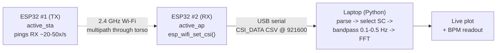

# Build a Breathing Monitor with ESP32 CSI

*A concrete, end-to-end mini-project: turn two ~$5 ESP32 boards into a contactless respiration monitor by reading Wi-Fi Channel State Information (CSI), streaming it to a laptop, and pulling breaths-per-minute out of the amplitude of a few subcarriers.*

> **Honest tier framing.** This is a **Tier 2 (CSI)** project, not SDR. You are not touching IQ, you are not transmitting an arbitrary waveform, and you cannot see the raw PHY. What the ESP32 hands you is a per-packet vector of complex channel estimates — one value per OFDM subcarrier — computed by closed silicon from the Wi-Fi preamble. That is a *rich* measurement (it moves when your chest moves), but it is a **diagnostic byproduct of demodulation**, and the firmware doing the estimation is a black box. Everything below is measurement and DSP on top of that byproduct. See [`../../docs/taxonomy.md`](../../docs/taxonomy.md) for where Tier 2 sits, and [`../true-sdr-comparison.md`](../true-sdr-comparison.md) for why this is not a HackRF.

---

## 1. What you'll build

A person sits or lies ~0.5–2 m between two ESP32 boards. One board (TX) continuously pings the other (RX). The RX board estimates the channel for every received packet and dumps a CSV line per packet over USB serial. A Python script on your laptop:

1. reads the serial stream,
2. parses each packet's CSI into per-subcarrier **amplitude**,
3. picks the most respiration-sensitive subcarriers,
4. band-pass filters them to the human breathing band (~0.1–0.5 Hz),
5. runs an FFT and reports **breaths per minute (BPM)**,
6. plots the waveform and the estimated rate live.

Chest wall motion of a few millimeters changes the multipath channel enough to modulate subcarrier amplitude by a percent or more — periodically, at breathing frequency. That periodicity is the whole game.



---

## 2. Bill of materials

| Item | Notes |
|---|---|
| 2 × ESP32 dev boards | Classic **ESP32** (ESP32-WROOM-32) is the reference target. ESP32-S2/S3/C3 also expose CSI but subcarrier layout and struct fields differ — start with the classic WROOM. |
| 2 × USB cables | One board can be TX-only (powered from a wall adapter); only the RX needs a data line to the laptop. |
| A laptop | Python 3.9+, `numpy`, `scipy`, `matplotlib`, `pyserial`. |
| A quiet-ish room | Fewer moving people/fans/pets = cleaner signal. LOS between boards is easiest. |

**Alternative topology (one ESP32 + a router):** run a single RX board in `active_sta` mode, associate it to your home router, and have it ping the router's gateway. The router's beacons/ACKs give you CSI without a second ESP32. This works but is *less controllable*: you don't own the transmit cadence, other clients perturb the channel, and rate/MCS can drift. **Two dedicated boards is the recommended, reproducible setup.**

---

## 3. Enabling CSI on the ESP32

CSI is a first-class (if lightly documented) ESP-IDF Wi-Fi feature. The three calls that matter live in `esp_wifi.h`:

```c
#include "esp_wifi.h"

// Called once per received packet by the Wi-Fi driver.
static void wifi_csi_rx_cb(void *ctx, wifi_csi_info_t *info)
{
    if (!info || !info->buf) return;

    // info->rx_ctrl : per-packet metadata (rssi, noise_floor, channel,
    //                 mcs, cwb/bandwidth, sig_mode, timestamp, ...)
    // info->mac[6]  : source MAC
    // info->first_word_invalid : if true, the first 4 bytes of buf are garbage
    //                 (a known ESP32 hardware quirk) — skip subcarrier 0.
    // info->buf     : int8_t array, TWO signed bytes per subcarrier:
    //                 buf[2k]   = imaginary part
    //                 buf[2k+1] = real part
    // info->len     : number of valid bytes in buf.

    // Fastest path: hand the raw line to serial and do DSP on the host.
    // (ESP32-CSI-Tool prints "CSI_DATA,...,[<space-separated ints>]")
}

void enable_csi(void)
{
    wifi_csi_config_t csi_config = {
        .lltf_en          = true,   // Legacy Long Training Field (64 SC @ 20 MHz)
        .htltf_en         = true,   // HT-LTF (802.11n)
        .stbc_htltf2_en   = true,   // second HT-LTF for STBC
        .ltf_merge_en     = true,
        .channel_filter_en= true,
        .manu_scale       = false,  // let the driver auto-scale
        .shift            = 0,
    };
    ESP_ERROR_CHECK( esp_wifi_set_csi_config(&csi_config) );
    ESP_ERROR_CHECK( esp_wifi_set_csi_rx_cb(&wifi_csi_rx_cb, NULL) );
    ESP_ERROR_CHECK( esp_wifi_set_csi(true) );   // master enable
}
```

> **IDF version drift.** The `wifi_csi_config_t` field names above are the ESP-IDF **v4.x** layout used by the ESP32-CSI-Tool (which pins **IDF v4.3**). In IDF **v5.x** the struct was reworked (e.g. an `enable_mask`-style config). If you build against v5, read your `esp_wifi_types.h` — do not copy field names blind.

### Subcarrier count — what `len` actually means

Each subcarrier is **2 bytes** (imaginary, then real; both `int8_t`). So:

| Mode | Training field | Subcarriers | `buf` length |
|---|---|---|---|
| 20 MHz (HT20) | LLTF | 64 | 128 bytes |
| 20 MHz (HT20) | HT-LTF | 64 | 128 bytes |
| 40 MHz (HT40) | HT-LTF + STBC-HT-LTF | up to 128 | up to 256+ bytes |

For a breathing monitor, **force everyone to HT20** and work with the 64-subcarrier LLTF/HT-LTF block. Of those 64, the DC bin and guard/null subcarriers carry no useful channel — you'll end up using roughly the **~52 data subcarriers**, and in practice just a handful of *stable* ones (see §7). Amplitude of subcarrier `k`:

```
amp[k] = sqrt(real[k]^2 + imag[k]^2)
phase[k] = atan2(imag[k], real[k])
```

---

## 4. The fast path: use the ESP32-CSI-Tool

Rather than write firmware from scratch, use **Steven M. Hernandez & Eyüphan Bulut's ESP32-CSI-Tool** ([github.com/StevenMHernandez/ESP32-CSI-Tool](https://github.com/StevenMHernandez/ESP32-CSI-Tool)) — the de facto reference firmware for ESP32 CSI collection. It ships three apps:

- **`active_ap/`** — the board becomes an access point. **Flash this on your RX board.** It enables CSI and prints one `CSI_DATA` CSV line per received packet.
- **`active_sta/`** — the board associates to an AP and sends packets at a fixed cadence. **Flash this on your TX board** (point it at the RX board's AP).
- **`passive/`** — sniffs CSI on a fixed channel without associating (channel 3 by default). Useful for the "one ESP32 + router" topology.

### Build & flash (per board)

```bash
# 1. Install ESP-IDF v4.3 (the tool is pinned to it) and export the env:
. $HOME/esp/esp-idf/export.sh

# 2. Get the tool:
git clone https://github.com/StevenMHernandez/ESP32-CSI-Tool
cd ESP32-CSI-Tool/active_ap        # (or active_sta on the other board)

# 3. Configure:
idf.py menuconfig
```

In `menuconfig`, the settings that matter for a clean respiration signal:

- **Component config → Wi-Fi → WiFi CSI(Channel State Information)** — *enabled*.
- **Serial flasher config → baud** and the app's console baud → **921600** (or higher). CSI is bandwidth-hungry; at 115200 you'll drop packets.
- **Component config → FreeRTOS → Tick rate (Hz) → 1000** — gives millisecond timestamp resolution.
- In the tool's own **"CSI Tool Configuration"** menu: set the SSID/channel so `active_sta` and `active_ap` agree, and pin the channel/bandwidth (HT20).

```bash
# 4. Flash and watch:
idf.py flash monitor
```

On the RX board you'll immediately see lines like:

```
CSI_DATA,AP,7C:9E:BD:xx:xx:xx,-42,11,1,7,1,1,1,0,0,0,1,0,-94,0,3,1,1541688,1,64,0,0,0,128,[  12 -3 8 -5 ... ]
```

The trailing bracketed array is the raw interleaved `int8_t` CSI (imag, real, imag, real, …). The leading columns are `rx_ctrl`/metadata: type, role, MAC, **RSSI**, rate, sig_mode, MCS, bandwidth, smoothing, not_sounding, aggregation, STBC, fec_coding, SGI, **noise_floor**, ampdu_cnt, **channel**, secondary_channel, local_timestamp, ant, sig_len, rx_state, real_time_flag, real_timestamp, and CSI `len`.

### Capture to disk

```bash
# Linux/macOS: keep only CSI lines
idf.py monitor | grep "CSI_DATA" > breathing_session.csv
# Windows:
idf.py monitor | findstr "CSI_DATA" > breathing_session.csv
```

The tool also bundles `python_utils/serial_append_time.py` (adds host wall-clock timestamps for syncing with ground truth) and `serial_plot_csi_live.py` (a raw amplitude live-plotter — a good "is it alive?" sanity check before you do any respiration DSP).

**Target sampling rate:** aim for **~20 Hz** (packets/sec) at the RX. Respiration is 0.1–0.5 Hz, so 20 Hz is comfortably above Nyquist and leaves headroom for filtering out motion and heartbeat. Set `active_sta`'s send cadence accordingly (it can push far faster; 20–50/s is plenty and keeps serial from choking).

---

## 5. Streaming CSI to the host in real time

You can post-process a CSV, but for a *live* monitor read the serial port directly:

```python
import serial, numpy as np

PORT = "/dev/ttyUSB0"     # or COMx on Windows
BAUD = 921600

def parse_csi_line(line: str):
    # Line: CSI_DATA,role,mac,rssi,...,len,[ i r i r ... ]
    if not line.startswith("CSI_DATA"):
        return None
    try:
        head, arr = line.split("[", 1)
        raw = np.fromstring(arr.strip().rstrip("]"), sep=" ", dtype=np.int8)
    except Exception:
        return None
    if raw.size < 128:            # expect 64 subcarriers * 2 for HT20
        return None
    imag = raw[0::2].astype(np.float32)
    real = raw[1::2].astype(np.float32)
    amp  = np.sqrt(real**2 + imag**2)      # per-subcarrier amplitude
    return amp                              # shape (64,)

ser = serial.Serial(PORT, BAUD, timeout=1)
while True:
    line = ser.readline().decode("utf-8", "ignore").strip()
    amp = parse_csi_line(line)
    if amp is not None:
        ...  # push into a rolling buffer (see §6)
```

> Note the byte order: **imaginary first, then real** (`buf[2k]=imag`, `buf[2k+1]=real`). Amplitude is order-independent, but if you ever compute phase, get this right.

---

## 6. Extracting the respiration signal

### 6.1 Build a per-subcarrier time series

Accumulate amplitudes into a matrix `X` of shape `(T, 64)` for a sliding window of, say, **30 seconds** (`T = 30 s × 20 Hz = 600` samples). Because packet arrivals jitter, resample onto a uniform grid:

```python
import numpy as np
from scipy.interpolate import interp1d

def uniform_resample(times, X, fs=20.0):
    t0, t1 = times[0], times[-1]
    tg = np.arange(t0, t1, 1.0/fs)
    f  = interp1d(times, X, axis=0, kind="linear", fill_value="extrapolate")
    return tg, f(tg)
```

### 6.2 Clean each subcarrier

Amplitude has bursty outliers (interference, retransmits) and a slow DC/trend from environment drift:

```python
from scipy.signal import detrend

def clean(x):
    # Hampel-style outlier clip (median +/- 3*MAD)
    med = np.median(x)
    mad = np.median(np.abs(x - med)) + 1e-6
    x   = np.clip(x, med - 3*1.4826*mad, med + 3*1.4826*mad)
    return detrend(x)                       # remove linear trend / DC
```

### 6.3 Pick stable, respiration-sensitive subcarriers

**This is the single most important step, and the honest reason CSI sensing is finicky.** Multipath fading means only *some* subcarriers land in a channel geometry where chest motion modulates them; others sit in a deep fade and carry only noise, and still others are corrupted (skip subcarrier 0 when `first_word_invalid`, plus DC/guard bins). Two cheap, effective selectors:

```python
from scipy.signal import butter, filtfilt

def bandpass(x, fs=20.0, lo=0.1, hi=0.5, order=4):
    b, a = butter(order, [lo, hi], btype="band", fs=fs)
    return filtfilt(b, a, x)

def score_subcarriers(X, fs=20.0):
    # X: (T, 64) cleaned. Score = in-band spectral concentration.
    scores = np.zeros(X.shape[1])
    for k in range(X.shape[1]):
        xb = bandpass(clean(X[:, k]), fs)
        P  = np.abs(np.fft.rfft(xb))**2
        f  = np.fft.rfftfreq(len(xb), 1/fs)
        band = (f >= 0.1) & (f <= 0.5)
        # peak-to-mean ratio inside the breathing band
        scores[k] = P[band].max() / (P.mean() + 1e-9)
    return scores

# Use the top few subcarriers, fused:
scores = score_subcarriers(X)
best   = np.argsort(scores)[-5:]           # 5 most periodic-in-band SCs
resp   = np.mean([bandpass(clean(X[:, k])) for k in best], axis=0)
```

Averaging a handful of the best subcarriers beats trusting any single one — it's a poor man's diversity combine. (Research systems go further: PCA across subcarriers, or CSI-ratio / conjugate-multiplication phase methods; see §8.)

> **Amplitude vs. phase.** On a single-antenna ESP32 the raw CSI **phase is dominated by carrier/sampling frequency offset (CFO/SFO)** between the two independent radios — it drifts and wraps and is *not* directly usable without sanitization. That's why this walkthrough uses **amplitude**, which is robust and needs no calibration. Multi-antenna rigs recover clean phase by *conjugate multiplication* between antennas on the same chip (offsets cancel); the ESP32's single RF chain can't do that across boards, so amplitude is the pragmatic choice here.

### 6.4 Estimate breaths per minute

```python
def breaths_per_minute(resp, fs=20.0):
    N = len(resp)
    win = resp * np.hanning(N)
    P = np.abs(np.fft.rfft(win))**2
    f = np.fft.rfftfreq(N, 1/fs)
    band = (f >= 0.1) & (f <= 0.5)         # 6-30 breaths/min
    fk = f[band][np.argmax(P[band])]       # dominant in-band frequency
    return fk * 60.0                       # Hz -> breaths/min
```

For an adult at rest (~12–20 BPM = 0.2–0.33 Hz) this lands the peak squarely in-band. A 30 s window gives ~0.033 Hz FFT resolution (~2 BPM bins); zero-pad or use a longer window for finer resolution, at the cost of latency.

---

## 7. Plotting it live in Python

```python
import numpy as np, serial, collections, time
import matplotlib.pyplot as plt
from matplotlib.animation import FuncAnimation

FS, WIN_S = 20.0, 30.0
N = int(FS * WIN_S)
buf_t = collections.deque(maxlen=N)
buf_X = collections.deque(maxlen=N)

ser = serial.Serial("/dev/ttyUSB0", 921600, timeout=1)

fig, (ax_wave, ax_bpm) = plt.subplots(2, 1, figsize=(8, 5))
(line_wave,) = ax_wave.plot([], [])
ax_wave.set_title("Respiration waveform (fused subcarriers)")
ax_wave.set_xlabel("seconds"); ax_wave.set_ylabel("amp (a.u.)")
bpm_txt = ax_bpm.text(0.5, 0.5, "-- BPM", ha="center", va="center", fontsize=48)
ax_bpm.axis("off")

def read_available():
    while ser.in_waiting:
        line = ser.readline().decode("utf-8", "ignore").strip()
        amp = parse_csi_line(line)         # from section 5
        if amp is not None:
            buf_t.append(time.time()); buf_X.append(amp[:64])

def update(_):
    read_available()
    if len(buf_X) < N:                     # wait for a full window
        return
    t  = np.array(buf_t); X = np.vstack(buf_X)
    tg, Xg = uniform_resample(t, X, FS)    # section 6.1
    scores = score_subcarriers(Xg, FS)     # section 6.3
    best   = np.argsort(scores)[-5:]
    resp   = np.mean([bandpass(clean(Xg[:, k]), FS) for k in best], axis=0)
    bpm    = breaths_per_minute(resp, FS)  # section 6.4
    line_wave.set_data(tg - tg[0], resp)
    ax_wave.set_xlim(0, tg[-1]-tg[0]); ax_wave.relim(); ax_wave.autoscale_view(scaley=True)
    bpm_txt.set_text(f"{bpm:4.1f} BPM")
    return line_wave, bpm_txt

ani = FuncAnimation(fig, update, interval=500)
plt.tight_layout(); plt.show()
```

Sit still ~1 m between the boards and breathe normally. Within one 30 s window you should see a clean ~0.25 Hz oscillation and a BPM readout that tracks when you deliberately breathe faster/slower. Hold your breath and the waveform flattens — the classic "it's really respiration" demo.

---

## 8. Honest limitations & robustness

CSI respiration monitoring **works and is genuinely repeatable in a controlled setting**, but it is fragile. Be blunt with yourself about all of this:

- **Any larger motion swamps breathing.** A moving arm, someone walking past, a pet, or a ceiling fan produces amplitude changes **1–2 orders of magnitude larger** than a breathing chest. The 0.1–0.5 Hz band-pass rejects fast motion, but slow gross body motion aliases straight into the breathing band and destroys the estimate. This is fundamentally a **still-subject** technique.
- **Multipath is a lottery.** Which subcarriers are respiration-sensitive depends on the exact room geometry, board placement, furniture, and where the person sits. Move a board 20 cm and your "good" subcarriers change. That's why §6.3 *re-selects* subcarriers every window instead of hard-coding indices.
- **Deep fades & blind spots.** At certain positions the chest motion sits at a null of the channel response and the signal nearly vanishes — a real "blind spot" problem in the literature (FullBreathe addresses it by fusing amplitude *and* phase). Two-antenna or two-link setups mitigate it; a single amplitude-only link does not.
- **Range.** Reliable out to ~1–2 m LOS. Through-wall/room-scale works in papers with better front-ends and phase sanitization, not reliably with two bare WROOMs.
- **Rate & packet loss.** If serial can't keep up (baud too low, USB contention) you drop packets, the effective `fs` sags, and jitter smears the FFT. Verify your real packet rate before trusting a BPM number.
- **Phase is not free.** Don't reach for raw ESP32 CSI phase expecting clean data — CFO/SFO between the two boards make it drift and wrap. Amplitude, or cross-antenna conjugate methods on a *single* multi-antenna receiver, are the trustworthy routes.
- **No medical claim.** This is a hobby/DSP demo. It is not a validated vital-signs device; don't use it for anything that matters medically.

**Sanity checks before believing a number:** confirm the raw amplitude live-plot moves with your breath *before* filtering; verify actual packets/sec; hold-breath test (waveform should flatten); and cross-check BPM against a manual count over 60 s.

---

## 9. References

**Reference firmware / tooling**
- S. M. Hernandez & E. Bulut, **ESP32-CSI-Tool** — https://github.com/StevenMHernandez/ESP32-CSI-Tool ; docs: https://stevenmhernandez.github.io/ESP32-CSI-Tool/
- S. M. Hernandez & E. Bulut, *"Lightweight and Standalone IoT Based WiFi Sensing for Active Repositioning and Mobility,"* IEEE WoWMoM 2020 (the paper the tool accompanies) — https://ieeexplore.ieee.org/document/9217452
- Espressif ESP-IDF Wi-Fi API — `esp_wifi_set_csi`, `esp_wifi_set_csi_config`, `esp_wifi_set_csi_rx_cb`, `wifi_csi_info_t`: https://docs.espressif.com/projects/esp-idf/en/latest/esp32/api-reference/network/esp_wifi.html
- ESP-IDF Wi-Fi Driver guide, "Wi-Fi Channel State Information": https://docs.espressif.com/projects/esp-idf/en/latest/esp32/api-guides/wifi.html

**Respiration / vital-signs from Wi-Fi CSI (foundational)**
- J. Liu et al., *"Tracking Vital Signs During Sleep Leveraging Off-the-shelf WiFi,"* ACM MobiHoc 2015 — https://dl.acm.org/doi/10.1145/2746285.2746303
- X. Wang, C. Yang, S. Mao, *"PhaseBeat: Exploiting CSI Phase Data for Vital Sign Monitoring with Commodity WiFi Devices,"* IEEE ICDCS 2017 — https://ieeexplore.ieee.org/document/7979979
- Y. Zeng et al., *"FullBreathe: Full Human Respiration Detection Exploiting Complementarity of CSI Phase and Amplitude of WiFi Signals,"* ACM IMWUT (UbiComp) 2018 — https://dl.acm.org/doi/10.1145/3264958
- H. Wang et al., *"Human Respiration Detection with Commodity WiFi Devices: Do User Location and Body Orientation Matter?"* ACM UbiComp 2016 (documents the "blind spot" problem) — https://dl.acm.org/doi/10.1145/2971648.2971744

**Method background**
- ESP32 CSI byte order & struct: `esp_wifi_types.h` in your local ESP-IDF checkout is the authoritative field reference for your IDF version.

---

## 10. Where to go next / cross-links

- **The chip:** what the ESP32 exposes (and doesn't) at each tier — [`../../chips/espressif.md`](../../chips/espressif.md).
- **CSI tooling across chips** (ESP32, Nexmon, Atheros, Intel 5300) and how their formats differ — [`../../projects/csi-toolchains.md`](../../projects/csi-toolchains.md).
- **Higher-fidelity CSI on Broadcom** (80/160 MHz, more subcarriers, richer phase) if you outgrow the ESP32 — [`nexmon-csi-to-usable-csi.md`](nexmon-csi-to-usable-csi.md).
- **Raw 802.11 TX/RX on ESP32** (the injection/monitor side, for a controlled TX source) — [`esp32-raw-80211-tx-promiscuous-rx.md`](esp32-raw-80211-tx-promiscuous-rx.md).
- **Why this isn't SDR** — [`../true-sdr-comparison.md`](../true-sdr-comparison.md) and [`../taxonomy.md`](../taxonomy.md).
- **Legal/RF-safety notes** before you leave a board transmitting 24/7 — [`../rf-safety-and-legal.md`](../rf-safety-and-legal.md).
